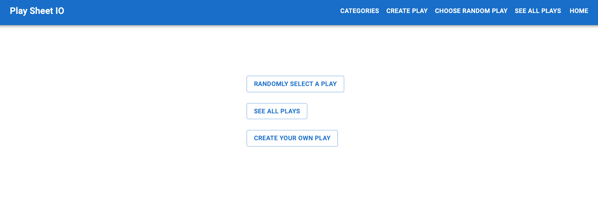
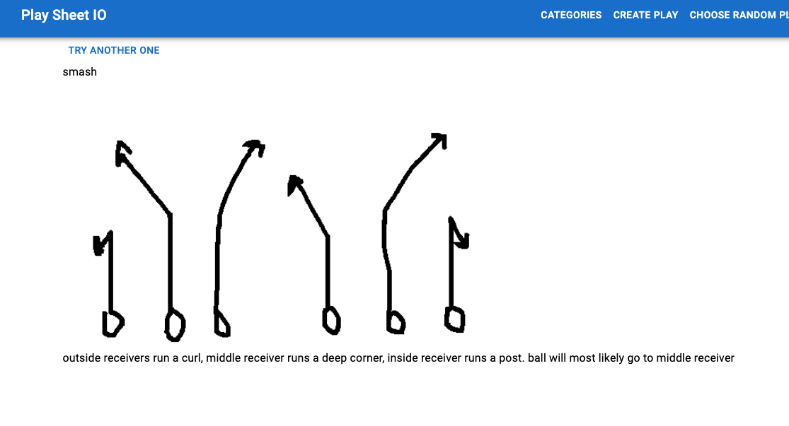
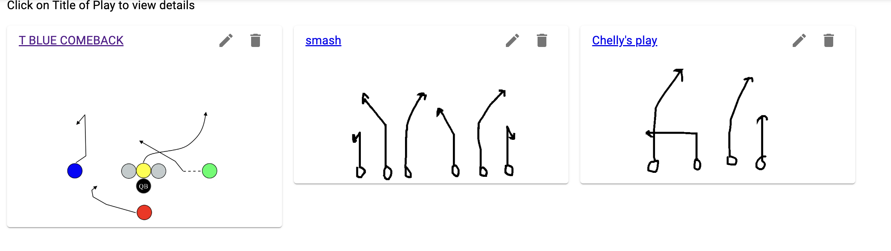
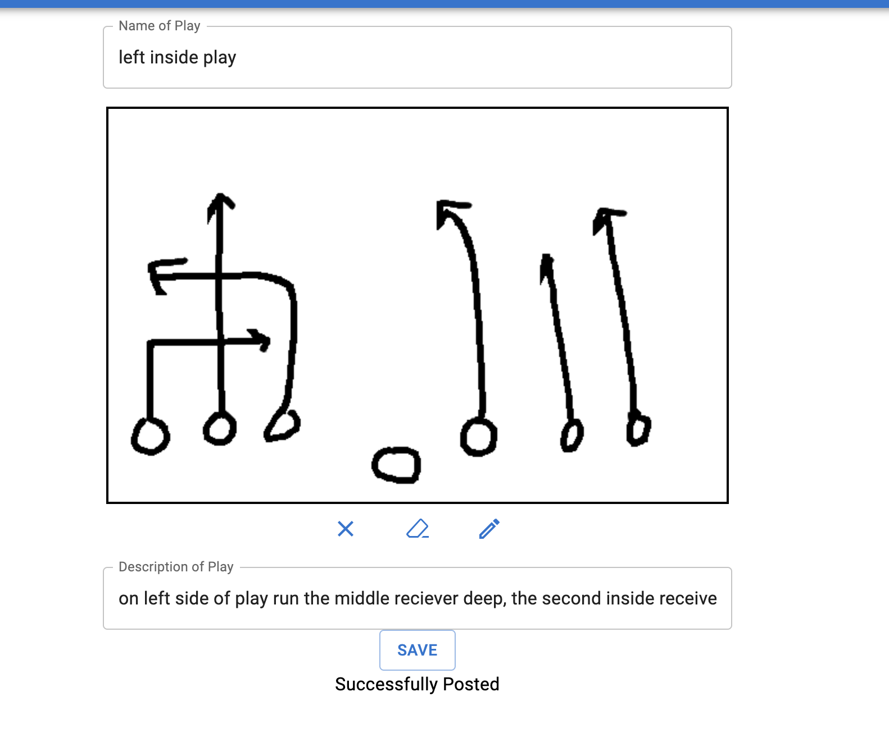
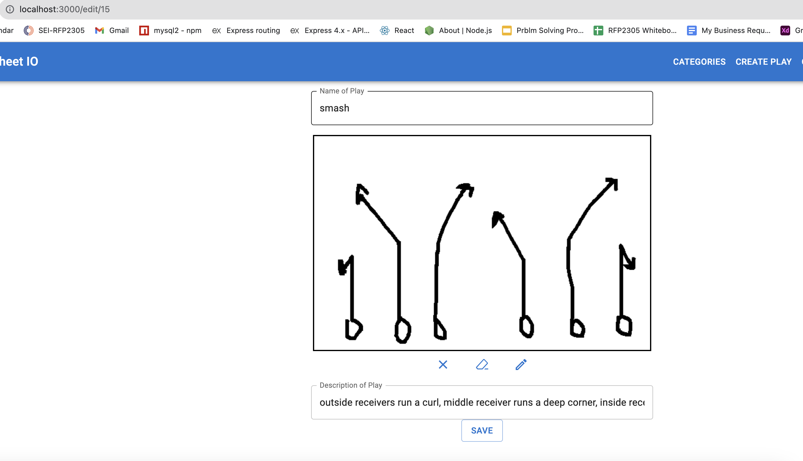

# Playsheet IO : Elevate Your Football Strategy 🏈

Welcome to Playsheet IO, your all-in-one digital playbook solution designed to take your football strategy to the next level.

## Key Features

- **Create and Customize Plays:** Use the intuitive digital canvas to draw up new plays for your flag football league. Tailor them to your team's strengths and strategies.

- **Save and Edit:** Store your playbook for easy access and make edits whenever you need to refine your tactics.

- **Random Play Generator:** Need a surprise element? Get a randomly selected play from your playbook to keep your opponents guessing.

## Behind the Scenes

- **Technology Stack:** Playsheet IO is a fullstack Javascript application(React, Express, Node, PostgresDB) built using the Canvas API for seamless drawing capabilities and styled with Material UI for an elegant and user-friendly experience.

- **Design Challenges:** I tackled the design and implementation of the edit page to ensure a smooth and efficient workflow for users.

## Upcoming Features

I am committed to enhancing your coaching experience. Here's a sneak peek at what's coming soon:

- **Organize by Situations:** Categorize your plays based on various game situations, making it easier to find the perfect play for any scenario.

- **Extended Canvas Features:** Expect even more tools and options to fine-tune your plays on the digital canvas.

Join me on this journey to revolutionize football coaching with Playsheet IO. Elevate your game today!

## Getting Started

1. Clone the repository using the following command on the command line.

git clone git@github.com:ocarvente/play-sheet-io.git

2. Change directories to the newly cloned repository.

cd play-sheet-io

3. Install dependencies

npm install

### Setting up the PostgreSQL Database

To use this application and its full functionality, you need to set up your PostgreSQL database. Here are the steps to get your database up and running:

1. **Download and Install PostgreSQL**:

- Refer to the [official PostgreSQL download page](https://www.postgresql.org/download/) to choose the correct installation for your situation. Follow the installation instructions for your operating system.

2. **Create a Database**:

- After PostgreSQL is installed, you need to create a new database for the application. You can use the PostgreSQL command-line tool (`psql`) or a graphical interface like pgAdmin to create the database.

CREATE DATABASE your_database_name;

### Apply the Schema and Data

In the root directory of the cloned repository, you'll find a SQL schema file named `postgresSchema.sql`. Follow these steps to apply the schema and initial data to your PostgreSQL database:

1. Open a terminal window and navigate to the project's root directory.

2. Use the `psql` command-line tool to connect to your PostgreSQL server and apply the schema:

   psql -h your_database_host -U your_database_user -d your_database_name -a -f postgresSchema.sql

Make sure to replace the placeholders (your_database_host, your_database_user, and your_database_name) with your actual database connection details.

Execute the command, and it will create the necessary tables and populate them with the initial data defined in the postgresSchema.sql file.

### Configure the .env file

1. In the root directory of the cloned repository, create a .env file if it doesn't already exist.

touch .env

2. Open the .env file in a text editor of your choice and add the following configuration information, replacing the placeholders with your actual database connection details:

HOST=your_database_host
PORT=your_database_port
USER=your_database_user
PASSWORD=your_database_password
NAME=your_database_name

Replace the placeholders as described above.

3. Save and Close .env file

Now, your application is configured to connect to the PostgreSQL database with the schema and initial data provided in the postgresSchema.sql file. You can proceed with running the application by following the instructions in the README.

If you encounter any issues during this setup process, please don't hesitate to reach out for assistance.

## How to Use the PlaySheet IO

Once everything has been configured you can run the app by running the following scripts in two separate terminals:
- npm run server
- npm run client-dev
- Open a browser and navigate to localhost:3000.
You will be greeted with a home screen with three different option:

### Randomly Selecting a Play
By clicking on the 'Randomly Select A Play 'button in the home screen, you will be navigated to a page that displays a full description of a randomly selected play stored in the database. When clicking on the 'Try Another One' button, the page will reload to chose another randomly selected play. This feature makes for a fun way to run something random without much planning and just for the heck of it.

### See all plays
See your entire playbook and just be in awe at your coaching prowess by clicking on the 'See All Plays' button. The see all page displays a running list of all plays currently saved. Two icons at the top right allow you to edit or delete the play. By clicking on the title you will be redirected to the full description play for that play. By clicking on the edit you will be directed to the edit page.

### Create your own play
So you think you can ball...this is the page for you. This page allows you to demosntrate your creativity. Draw out a play by using the canvas while using some of the initial features of the whiteboard. Expect more fun things to come in this page.

### Extras

The navigation bar allows you to peruse through the different offerings from anywhere on the application.  You may have noticed the categories page, a new feature coming soon!

After clicking the edit on a card you can edit that play in the edit mode. If you know the id for a particular play you may go directly to that url to edit.

